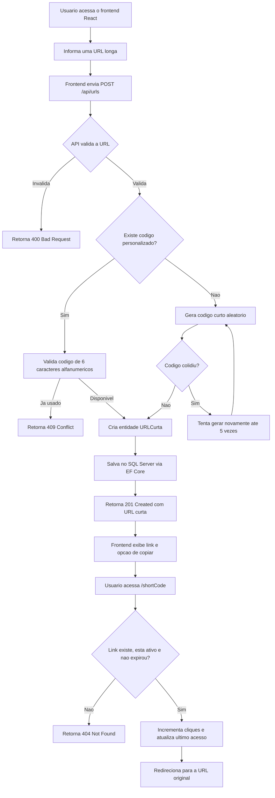

# LinkCM

LinkCM e um encurtador de URLs full stack feito com ASP.NET Core, Entity Framework Core, SQL Server e React. A aplicacao permite transformar uma URL longa em um link curto, persistir esse link no banco e redirecionar acessos futuros para a URL original contabilizando cliques.

## Visao Geral

- Frontend em React com Vite para inserir a URL, enviar a requisicao e copiar o link gerado.
- API em ASP.NET Core para validar URLs, gerar codigos curtos e redirecionar acessos.
- Persistencia com SQL Server e Entity Framework Core.
- Migrations aplicadas automaticamente na inicializacao da API.
- Suporte a codigo personalizado com exatamente 6 caracteres alfanumericos.
- Expiracao de links, status ativo e contagem de acessos.
- Ambiente containerizado com Docker Compose.
- Testes unitarios para geracao de codigos e validacao de URLs.

## Fluxo da Aplicacao



## Arquitetura

```text
LinkCM
+-- LINKCM.API
|   +-- Controllers       # Endpoints HTTP
|   +-- Data              # DbContext
|   +-- DTOs              # Contratos de entrada e saida
|   +-- Models            # Entidade URLCurta
|   +-- Services          # Gerador de codigos curtos
|   +-- Migrations        # Historico EF Core
|   +-- Tests             # Testes xUnit
+-- LINKCM.Frontend
|   +-- src               # Aplicacao React/Vite
+-- docker-compose.yml    # API, frontend e SQL Server
```

## Tecnologias

- .NET 10
- ASP.NET Core
- Entity Framework Core
- SQL Server 2022
- React
- Vite
- Docker e Docker Compose
- xUnit

## Como Executar com Docker

Crie um arquivo `.env` na raiz do projeto:

```env
SA_PASSWORD=SuaSenhaForte!123
```

Suba os containers:

```bash
docker compose up --build
```

Servicos disponiveis:

- Frontend: `http://localhost:5173`
- API: `http://localhost:8080`
- SQL Server: `localhost:1433`

Na primeira inicializacao, a API aplica automaticamente as migrations do Entity Framework e cria o banco `LinkCM`.

Para parar:

```bash
docker compose down
```

Para parar e remover tambem o volume do banco:

```bash
docker compose down -v
```

## Como Executar Localmente

### API

Entre na pasta da API:

```bash
cd LINKCM.API
dotnet restore
dotnet run
```

A API sobe em:

```text
http://localhost:8080
```

### Frontend

Entre na pasta do frontend:

```bash
cd LINKCM.Frontend
npm install
npm run dev
```

Configure a URL da API no ambiente do Vite, quando necessario:

```env
VITE_API_URL=http://localhost:8080
```

## Endpoints

### Criar URL curta

```http
POST /api/urls
Content-Type: application/json
```

Corpo minimo:

```json
{
  "url": "https://exemplo.com/minha-url-muito-longa"
}
```

Corpo com codigo personalizado e expiracao:

```json
{
  "url": "https://exemplo.com/minha-url-muito-longa",
  "customCode": "Abc123",
  "dataExpira": "2026-12-31T23:59:59"
}
```

Resposta de sucesso:

```json
{
  "id": 1,
  "urlCurta": "http://localhost:8080/Abc123",
  "urlOriginal": "https://exemplo.com/minha-url-muito-longa",
  "shortCode": "Abc123",
  "dataCriacao": "2026-07-28T10:00:00",
  "dataExpira": "2026-12-31T23:59:59",
  "contasAcessadas": 0
}
```

Possiveis retornos:

- `201 Created`: URL curta criada.
- `400 Bad Request`: URL invalida, codigo invalido ou data de expiracao no passado.
- `409 Conflict`: codigo personalizado ja esta em uso.
- `503 Service Unavailable`: nao foi possivel gerar um codigo unico apos as tentativas.

### Redirecionar URL curta

```http
GET /{shortCode}
```

Se o link existir, estiver ativo e nao estiver expirado, a API incrementa a contagem de cliques, atualiza o ultimo acesso e redireciona para a URL original.

## Testes

Execute os testes da API:

```bash
dotnet test LINKCM.API/Tests/LinkCM.Tests.csproj
```

Os testes cobrem:

- tamanho padrao do codigo curto;
- validacao de codigos personalizados;
- validacao de URLs com `http` e `https`.

## Regras de Negocio

- URLs aceitas precisam comecar com `http` ou `https`.
- Codigo personalizado precisa ter exatamente 6 caracteres alfanumericos.
- Codigos curtos sao unicos no banco.
- Links sem data de expiracao informada expiram em 1 ano.
- Links expirados, inativos ou inexistentes retornam `404`.
- Cada redirecionamento valido incrementa `QuantidadeCliques`.

## Conteudo para LinkedIn

O arquivo [LINKEDIN_POST.md](LINKEDIN_POST.md) contem um diagrama Mermaid e um texto pronto para publicacao sobre o projeto.
